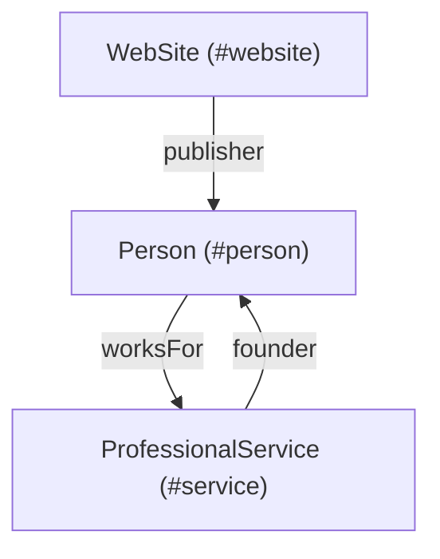

# Structured Data (Schema.org) Report: alejomonardez.com

**URL:** [https://alejomonardez.com](https://alejomonardez.com)  
**Date:** 2026-05-31  
**Format Detected:** JSON-LD (3 blocks) | No Microdata | No RDFa  
**Overall Schema Health Grade:** **A-** (Strong foundation, minor mapping/linkage improvements needed)

---

## Executive Summary

We detected **3 JSON-LD blocks** on the homepage of `alejomonardez.com`. The semantic structure maps the identity of the owner (`Person`), the website itself (`WebSite`), and the freelance professional entity (`ProfessionalService`). 

While all blocks parse successfully and use valid Schema.org syntax, they exist as largely independent entities. Linking them into a single connected graph will clarify identity signals for Google and AI-based search engines.

---

## Existing Schema Validation

| Block | Schema Type | Entity ID | Status | Key Issues / Opportunities |
| :--- | :--- | :--- | :---: | :--- |
| **1** | `Person` | `.../#person` | **Good** | Alternate name contains double-encoding artifact; `worksFor` is set to generic "Freelance" organization instead of the professional service. |
| **2** | `WebSite` | `.../#website` | **Valid** | Comment mentions `SearchAction` but the block does not implement it. |
| **3** | `ProfessionalService` | *None* | **Warning** | Lacks `@id` identifier; not linked to the `Person` block. Missing description and logo. |

---

## Detailed Audit Findings

### 1. HTTP Content-Type Charset Header Issue
> [!WARNING]
> The server is sending `Content-Type: text/html` without a `charset=utf-8` directive. Although the HTML contains `<meta charset="UTF-8" />`, some HTTP clients and older search crawlers default to `ISO-8859-1` when the HTTP header lacks a charset. This causes double-encoding/corruption of special characters (e.g. `Monárdez` parsed as `Monárdez` and `—` parsed as `—`) during crawl.
> **Fix:** Configure the web server (Nginx/Apache) to explicitly append the charset: `Content-Type: text/html; charset=utf-8`.

### 2. Disconnected Entity Graph
Structured data works best when it forms a linked graph. Currently:
- The `ProfessionalService` block is standalone.
- The `Person` block has `"worksFor": { "@type": "Organization", "name": "Freelance" }`.
- **Optimization:** We can link `Person` and `ProfessionalService` by giving the service an `@id` (`#service`) and using the `worksFor` and `founder`/`owner` properties.

### 3. Missing Properties
- **ProfessionalService**: Missing `"logo"`, `"description"`, and `"founder"` properties.
- **WebSite**: Commented as including `SearchAction` but it is missing the `potentialAction` block. Since single-page portfolios rarely have internal search pages, it's recommended to either add the search template or clean up the HTML comment.

---

## Action Plan & Corrected Schema

We have generated a fully optimized and unified schema graph which is saved in [generated-schema.json](file:///c:/xampp/htdocs/portafolio%20web%20mo%C3%B1i/docs/seo/generated-schema.json). 

### How the Graph Connects:

### Recommendation Code Snippet:
Replace the three separate `<script type="application/ld+json">` blocks in your homepage HTML header with the unified script in [generated-schema.json](file:///c:/xampp/htdocs/portafolio%20web%20mo%C3%B1i/docs/seo/generated-schema.json).
